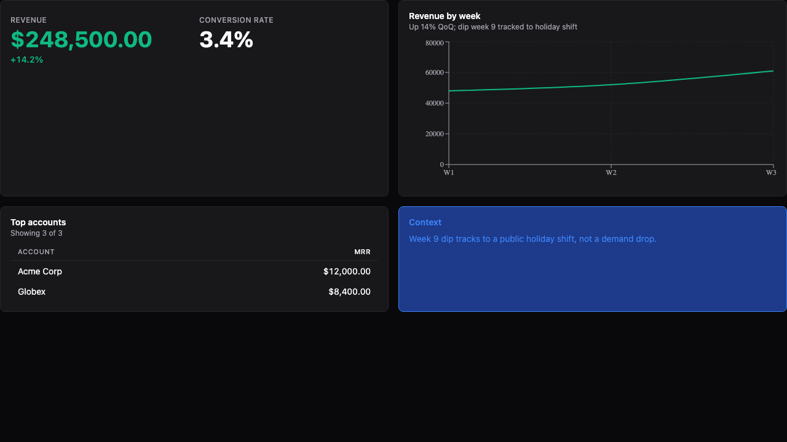
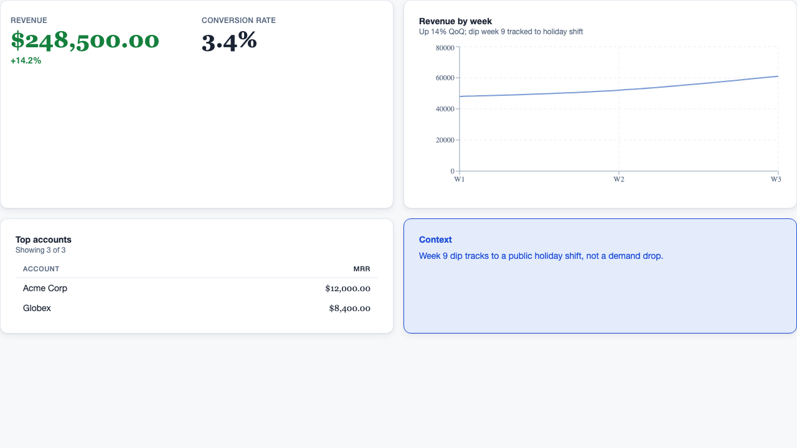
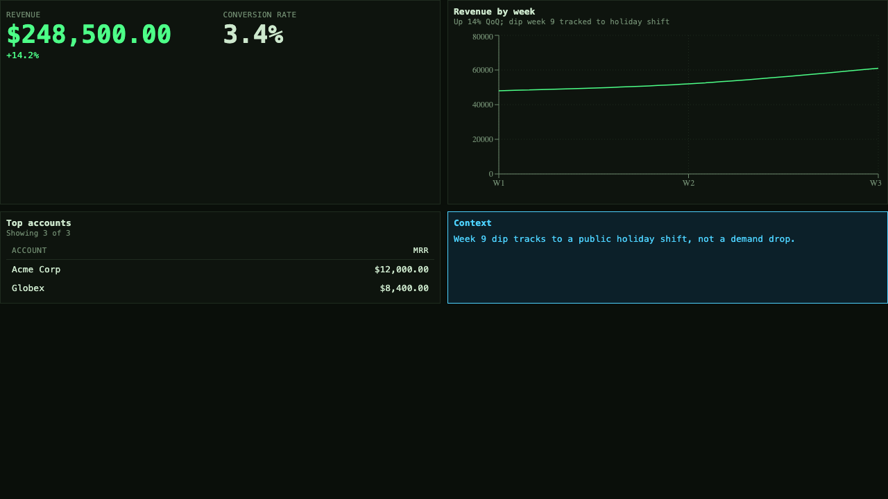
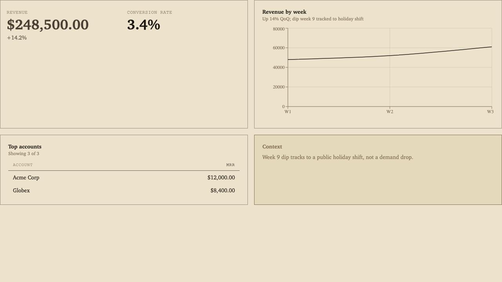
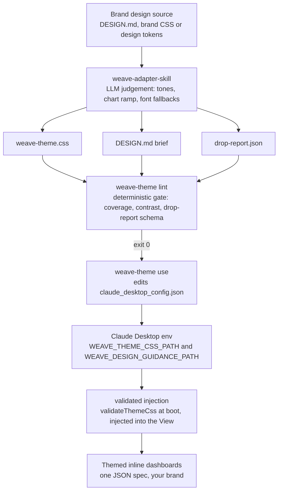

# Weave

[](LICENSE)


JSON-composable React primitives and a companion MCP server for LLM-driven dashboards. The LLM composes a validated JSON tree of primitives and the host app's theme owns every pixel: the model decides what to show, the host decides how it looks.

The differentiator: an agent renders branded dashboards inline in Claude Desktop, unprompted when an answer is data-shaped, themed to your brand through the design-source adapter.

> **Status:** pre-release. Not yet published to npm, and the primitive and tool APIs may still change before the first stable release.

## One spec, four brands

The same dashboard spec, rendered under four themes. Nothing in the spec changes between these four; only the host theme differs.

| | |
|---|---|
| <br>**Default**: dark, teal accent, sans | <br>**Corporate light**: white cards, serif numerals, navy |
| <br>**Terminal dense**: monospace, green, square corners | <br>**Brand Iron**: warm paper, editorial, hairlines |

An LLM emits one JSON spec (KPIs, a chart, a table and a note). The primitives read every colour, font, space and radius from CSS variables, so swapping the theme re-skins the whole dashboard with no spec change. These four are generated by the `weave-mcp-app` acceptance test, which also asserts the computed styles are pairwise different.

## How brand theming works

A brand's design source becomes a validated, reviewed theme through one authoring pass and a deterministic gate. The LLM never emits CSS into the running system; it authors a static theme offline, the linter gates it, the host loads the reviewed file.



The split is deliberate: the model authors (judgement), the linter gates (determinism), the host loads a reviewed static file (safety). Even the boot-time load re-validates the CSS against the token contract before injecting it.

## Packages

| Package | Purpose |
|---|---|
| [`weave-primitives`](packages/weave-primitives) | Theme-neutral React primitives and Zod schemas; renders a JSON spec against the host's CSS variables |
| [`weave-tokens`](packages/weave-tokens) | Default CSS variables (opt-in), the machine-readable token contract (`tokens.json`) and the theme-CSS validator (`./validate`) |
| [`weave-skill`](packages/weave-skill) | `SKILL.md` teaching an LLM how to compose primitive specs (and when to visualise unprompted) |
| [`weave-mcp-server`](packages/weave-mcp-server) | HTTP server exposing the five `render_*` tools as validated JSON |
| [`weave-mcp-app`](packages/weave-mcp-app) | MCP App rendering dashboards inline in Claude Desktop, with host-configured brand theming (private, unpublished) |
| [`weave-adapter-skill`](packages/weave-adapter-skill) | `SKILL.md` teaching an LLM to convert a brand's design source into a validated Weave theme |
| [`weave-theme-cli`](packages/weave-theme-cli) | The `weave-theme` CLI: the authoring-time lint gate plus one-command theme switching for Claude Desktop |

## Quickstart

**Bring your own brand.** Go from clone to a dashboard themed to your brand, rendering inline in Claude Desktop, in about 15 minutes: [docs/quickstart-byob.md](docs/quickstart-byob.md).

Local development:

```bash
pnpm install
pnpm build
pnpm test
pnpm --filter @shepherd-creative/weave-mcp-server dev   # HTTP tool server on :8787
```

Verify a checkout the way CI would:

```bash
pnpm typecheck && pnpm test
```

## Status and roadmap

Design-source theming has shipped: the expanded token contract, the adapter skill, the deterministic lint gate and one-command theme switching. Still ahead are runtime theme switching, multi-brand registries and host-delivered fonts. See [docs/future-directions/design-source-integration.md](docs/future-directions/design-source-integration.md).

## Contributing

Monorepo layout, the verify gate and the release flow live in [CONTRIBUTING.md](CONTRIBUTING.md).

## Licence

MIT. See [LICENSE](LICENSE).
